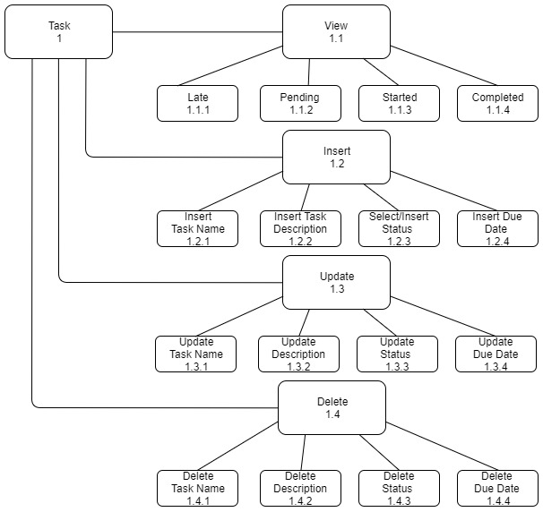
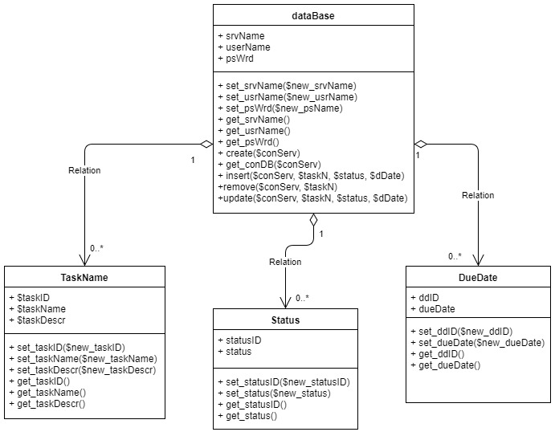

# 4996Homework1

#### Table of Contents 

1. [Description](#description) 
2. [Setup](#setup) 
3. [Demployment](#deployment)
4. [Requirements](#requirements)
    * [Functional](#functional) 
    * [Non Functional](#nonFunctional) 
5. [System Architecture Diagram](#architectureDiagram) 
6. [Data Flow Diagram](#dataFlowDiagram)
7. [Use Case](#useCase) 
8. [Sequence Diagram](#sequenceDiagram)
9. [Database Design](#dbDesign) 
10. [Class Diagram](#classDiagram)
11. [Test Case](#testCase) 

## Description 
This is an application that would be use as a simple to do application. In this application the user can view, add, delete, and update the tasks. The tasks table will contain the task id, task name, status, and the due date. 

## Setup 
1. Install the WAMP from https://sourceforge.net/projects/wampserver/files/
1. Luanch and make sure WAMP is running 

## Deployment
1. Launch WAMP and make sure that it is running
1. Create a ToDoApp folder withing the wamp64/www directory
1. Download the zip file and unzip the files into the wamp64/www directory ToDoApp folder 
1. Open the broswer of your choice that work with WAMP
1. The use the following link http://localhost/ToDoApp/Index.php
1. The ToDoApp should be displayed on the screen 

## Requirements 
### Functional
1. User needs to be able to view tasks
1. User needs to be able to add tasks
1. User needs to be able to delete tasks
1. User needs to be able to update tasks
1. User needs to be able to view task according to status 
1. User needs to be able to view the number of tasks with certain status
 
### Non Functional
1. Ease of use 
1. Reliability 
1. Use of multiple classes
1. Use of multiple data tables 
1. Capacity  
1. Scalability

## System Architecture Diagram

## Data Flow Diagram

## Use Cases

## Sequence Diagram

## Database Design 

## Class Diagram

## Test Cases

### View Tasks With Status = Started 
#### Description
Test the ability to view tasks with only where status is equal to started. 
#### Steps 
1. Open broswer window and enter the link http://localhost/ToDoApp/Index.php
1. Click on the "STARTED" Button 
#### Expected Results
The table displayed after clicking on the "STARTED" button will now contain only 
rows where status is equal to started. 
#### Actual Results 

#### Passed/Failed 

### View Tasks With Status = Completed  
#### Description
Test the ability to view tasks with only where status is equal to completed. 
#### Steps 
1. Open broswer window and enter the link http://localhost/ToDoApp/Index.php
1. Click on the "COMPLETED" Button 
#### Expected Results
The table displayed after clicking on the "COMPLETED" button will now contain only 
rows where status is equal to completed. 
#### Actual Results 

#### Passed/Failed 

### Inserting A New Task
#### Description
Test the ability to insert a new task into the table displayed on the page. 
#### Steps 
1. Open broswer window and enter the link http://localhost/ToDoApp/Index.php
1. Click on the green "ADD" Button  
1. Fill out the requested information
1. Click the submit button 
#### Expected Results
The task should be added to the bottom of the table. 
#### Actual Results 
#### Passed/Failed 

### Update A Task
#### Description
Test the ability of updating an existing task in the table displayed on the page.
#### Steps 
1. Open broswer window and enter the link http://localhost/ToDoApp/Index.php
1. Click on the blue "UPDATE" Button
1. Enter the Task ID of the row you want to update and fill out the requested information
1. Click the submit button
#### Expected Results
The row of the requested Task ID should be changed accordingly.
#### Actual Results 
#### Passed/Failed 

### Deleting A Task 
#### Description
Test the ability to delete a task from the table displayed on the page.
#### Steps 
1. Open broswer window and enter the link http://localhost/ToDoApp/Index.php
1. Click on the red "DELETE" Button 
1. Enter a valid task ID from the table, in the space provided, of the task you would like to delete 
1. Click the submit button
#### Expected Results
The row of the Task ID entered should be deleted.
#### Actual Results 
#### Passed/Failed 

### Deleting A Non-Existing Row 
#### Description
Test to see if the application handles invalid Task ID'd enter by the user when trying to delete a task. 
#### Steps 
1. Open broswer window and enter the link http://localhost/ToDoApp/Index.php
1. Click on the red "DELETE" Button 
1. Enter a invalid task ID from teh table, in the space provided, of the task you would like to delete 
1. Click the submit button
#### Expected Results
A statement above the displayed table should pop up stating "Task ID: (entered id) Is Invalid."
#### Actual Results 
#### Passed/Failed 
